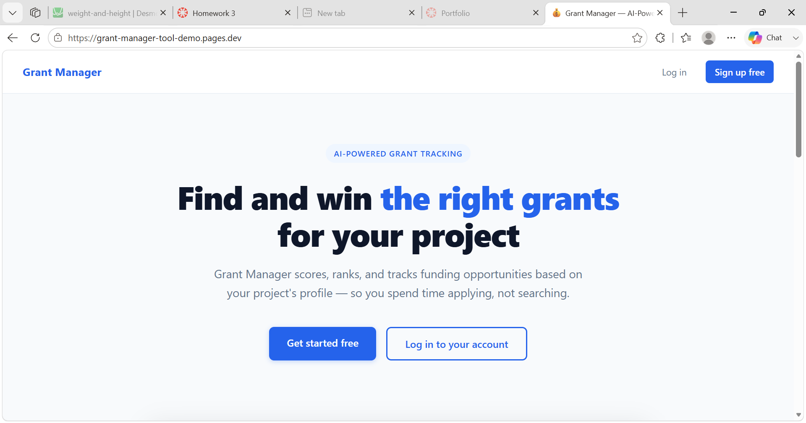
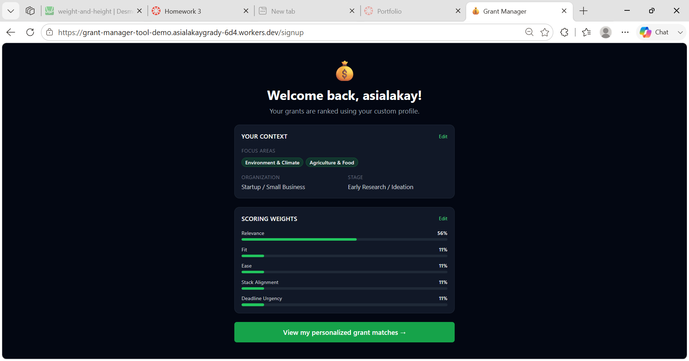
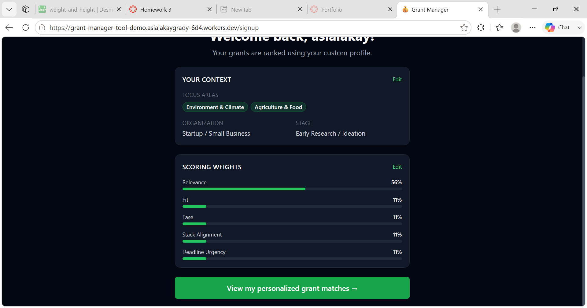
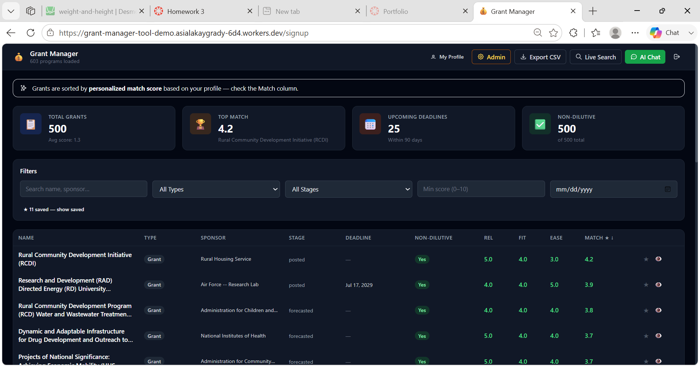

# FoundationPlanner

## 🔗 Live Demo

**[https://grant-manager-tool-demo.asialakaygrady-6d4.workers.dev](https://grant-manager-tool-demo.asialakaygrady-6d4.workers.dev)**

603 non-dilutive grants loaded, personalized scoring live.

> **Demo login:** username `demo` · password `demo`

---

**A data-driven grant discovery and scoring engine for mission-aligned organizations.**
Built on Cloudflare's edge infrastructure. 603 non-dilutive funding opportunities. Personalized match scoring. AI-assisted research. Live in production.

## Screenshots









---

## The Problem

Community-serving organizations — co-ops, nonprofits, small businesses, workforce programs — find grants through intuition and word of mouth. They miss opportunities, pursue poor fits, and have no systematic way to prioritize. The result is underfunded missions and staff making high-stakes decisions based on incomplete information.

## The Solution

FoundationPlanner replaces guesswork with a weighted, auditable decision framework. Users create an organizational profile — focus area, stage, eligibility, scoring priorities — and the platform ranks non-dilutive funding opportunities by personalized match score in real time.

Every grant in the dataset is non-dilutive. No equity. No repayment. No strings to investors.

---

## What It Does

### Personalized Match Scoring
Each user configures scoring weights across five dimensions: **Relevance**, **Fit**, **Ease**, **Stack Alignment**, and **Deadline Urgency**. The platform ranks all 603 opportunities against that profile on every load. No two users see the same ranked list.

### AI-Assisted Research
The built-in AI assistant analyzes patterns across the full dataset — surfacing non-obvious matches, identifying duplicate opportunities across cohort years, and answering natural language questions about eligibility and fit.

### Grant Discovery Pipeline
A full data pipeline runs from Grants.gov API search through normalization, scoring, and import into the live dashboard. The pipeline is documented, repeatable, and extensible.

### Workflow Tools
- Live keyword and filter search across all 603 programs
- Save, hide, and annotate individual opportunities per user
- Export to CSV for grant writing and reporting workflows
- Role-based auth with per-user scoring profiles
- Deadline tracking — 27 opportunities closing within 90 days

---

## Live Product

| Metric | Value |
|---|---|
| Total grants loaded | 603 |
| All non-dilutive | 603 / 603 |
| Top match score | 3.2 |
| Upcoming deadlines (90 days) | 27 |
| Production deployments | 43 |
| Infrastructure | Cloudflare Workers + D1 + KV + R2 |

**[View the live dashboard →](https://grant-manager-tool-demo.asialakaygrady-6d4.workers.dev)**

> **Demo login:** username `demo` · password `demo`

---

## Architecture

```
Grants.gov API → Python pipeline (search · wrangle · score) → D1 Database → Cloudflare Worker (Dashboard + API)
```
Weights are configurable per user. The scoring profile is stored in KV and applied at query time — not baked into the dataset.

### Stack
- **Runtime:** Cloudflare Workers (edge, zero cold starts)
- **Database:** D1 SQLite — programs schema, 17 columns
- **Storage:** KV (user profiles, session state) · R2 (PDF documents)
- **AI:** Cloudflare Workers AI — Llama-3-8B via `/api/chat`
- **Data pipeline:** Python 3.9+ (search, wrangle, score, summarize)
- **Auth:** PBKDF2-HMAC-SHA256 (600 000 iterations, random salt) via [WebCrypto API](https://developers.cloudflare.com/workers/runtime-apis/web-crypto/) · session cookies · login attempt lockout · lazy hash upgrade (SHA-256 legacy hashes are re-hashed on next successful login)

---

## Key Components

### Cloudflare Worker (`worker.js`)
Primary production deployment. Handles authentication, dashboard rendering, user profile management, and grant scoring. Full endpoint reference in [DEVELOPERS.md](docs/DEVELOPERS.md).

### Python Pipeline
Four production-ready CLI tools for data acquisition, normalization, scoring, and PDF summarization. The full pipeline documentation is in [DEVELOPERS.md](docs/DEVELOPERS.md).

```bash
# Search Grants.gov
python search_grants.py "workforce development" --filter "opportunityStatuses=posted"

# Normalize and merge datasets
python wrangle_grants.py --input data/ --out master.csv --print-summary

# Score opportunities
python program_scoring.py master.csv --out scored.csv

# Load into D1 (one command runs the full pipeline: wrangle → score → import)
make import          # load to remote D1
make import-local    # load to local D1 preview

# Summarize grant PDFs
grant-summarizer --pdf grant.pdf --format all --outdir ./dist
```

### Scoring Algorithm
```
Score = 0.3×Relevance + 0.3×Fit + 0.2×Ease + 0.1×StackAlignment + 0.1×DeadlineUrgency
```
Weights are configurable per user. The scoring profile is stored in KV and applied at query time — not baked into the dataset.

Full schema definition: [docs/data_contract.json](docs/data_contract.json).

### Admin CSV Upload

Admin users see an **Upload CSV** button on the dashboard that bulk-imports grants
into D1 via `POST /api/admin/upload-csv`. The CSV needs a header row with a `Name`
column; other recognized columns (Type, Sponsor, Source URL, Deadline / Next Cohort,
Benefits, Relevance, Fit, Ease, …) are matched case- and whitespace-insensitively,
and unknown columns are ignored. Two import modes:

- **Merge** (default) — inserts new grants and updates existing ones, matched by Name.
- **Replace** — wipes the `programs` table before importing.

Admins are configured with the `ADMIN_USERS` var in `wrangler.toml`
(comma-separated usernames; defaults to the built-in `demo` account).

---

## Quick Deploy

```bash
# 1. Clone
git clone https://github.com/asiakay/grant-manager-tool-demo
cd grant-manager-tool-demo

# 2. Install dependencies
pip install -r requirements.txt
cd worker && npm install && cd ..

# 3. Configure Cloudflare
wrangler login
wrangler d1 create GRANT_MANAGER_DB
wrangler kv:namespace create USER_PROFILES
wrangler kv:namespace create LOGIN_ATTEMPTS
wrangler r2 bucket create pdf-bucket

# 4. Set credentials as a secret (never in wrangler.toml)
#    USER_HASHES values must be PBKDF2 hashes. Generate one with:
#      node -e "
#        const s=crypto.getRandomValues(new Uint8Array(16));
#        const k=await crypto.subtle.importKey('raw',new TextEncoder().encode('yourpassword'),'PBKDF2',false,['deriveBits']);
#        const d=await crypto.subtle.deriveBits({name:'PBKDF2',hash:'SHA-256',salt:s,iterations:600000},k,256);
#        const h=b=>Array.from(new Uint8Array(b)).map(x=>x.toString(16).padStart(2,'0')).join('');
#        console.log('pbkdf2\$600000\$'+h(s)+'\$'+h(d));
#      "
#    Then: wrangler secret put USER_HASHES
#    Paste: {"admin":"pbkdf2$600000$<salt>$<hash>"}
wrangler secret put USER_HASHES

# 5. Apply migrations and deploy
cd worker
wrangler d1 migrations apply GRANT_MANAGER_DB
npm run deploy
```

Full setup documentation: [DEVELOPERS.md](docs/DEVELOPERS.md)

---

## Roadmap

- **PDF processing pipeline** — A Queue-based worker ([`drafts/pdf_worker.ts`](drafts/pdf_worker.ts)) ingests grant PDFs from R2 via `grant_summarizer` and imports scored rows into D1. Prototyped; pending hosted `GRANT_SUMMARIZER_URL` and Cloudflare Queue provisioning.

---

## Documentation

| Document | Contents |
|---|---|
| [DEVELOPERS.md](docs/DEVELOPERS.md) | Full pipeline docs, CLI reference, API guide |
| [docs/AGENTS.md](docs/AGENTS.md) | Data pipeline runbook |
| [docs/AGENTS_AUTOMATION.md](docs/AGENTS_AUTOMATION.md) | Automation guide |
| [docs/data_contract.json](docs/data_contract.json) | Database schema and field definitions |
| [docs/pipeline_vs_direct_write.md](docs/pipeline_vs_direct_write.md) | Architecture decision record |

---

## The Builder

**Asia Grady** is a cooperative economist, civic technologist, and builder based in Jamaica Plain, Boston. She is developing a portfolio of civic infrastructure projects at the intersection of Afrofuturism, cooperative economics, and community wealth — spanning energy, capital access, civic education, and media. She holds published research in urban economics and AI systems.

This tool was built on personal time, with no institutional support. The IP belongs to its builder.

- [LinkedIn](https://www.linkedin.com/in/asia-lakay-grady/)
- [GitHub](https://github.com/asiakay)

---

## Licensing

This repository is source-available for evaluation purposes. Licensing inquiries welcome.

For partnership discussions or licensing: [LinkedIn](https://www.linkedin.com/in/asia-lakay-grady/)

---

*FoundationPlanner · Jamaica Plain, Boston · 2026*
